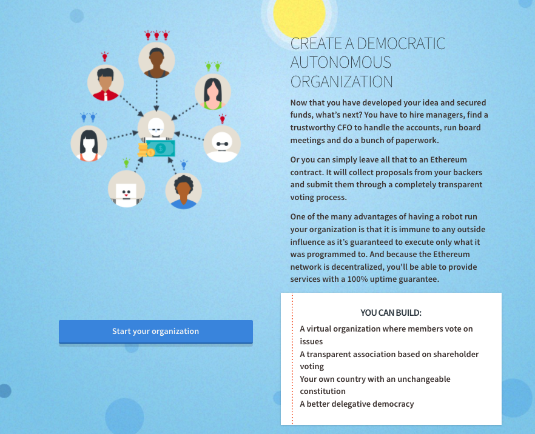
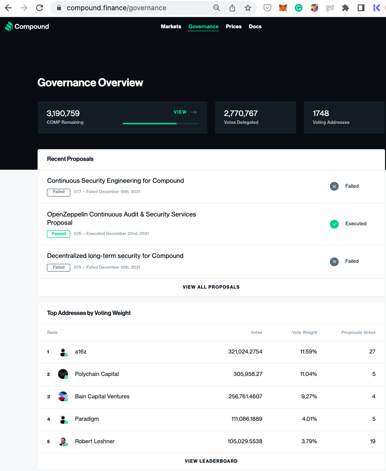
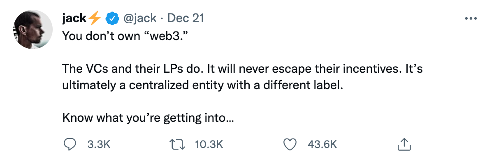
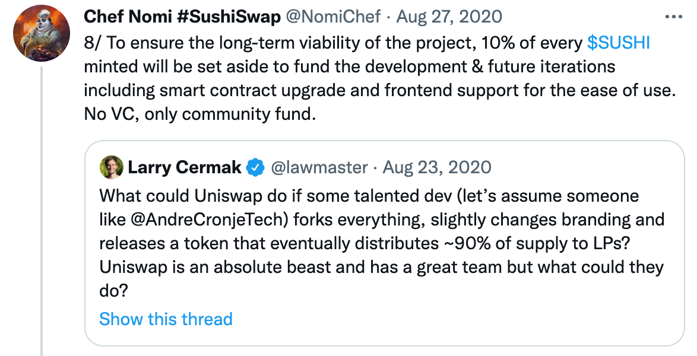

- TheDAO
- Defi Summer
- Jpeg Summer
- フェアローンチ

## DAOの起源

Decentralized Autonomous Organisation の起源ですが、Ethereumの創始者である[Vitalik Buterlin が２０１３年ごろに作り上げた言葉だと自ら述べています](https://medium.com/@VitalikButerin/i-invented-the-term-in-2013-and-daniel-larimer-came-up-with-dacs-s-organization-corporation-a-ef86db1524d5)。ただそれより少し前にもBitshareという投票システムなどのあるブロックチェーンシステムを作り上げた（EOSという他のブロックチェーンシステムを創設したことでも有名である）Dan Larimerが提唱したDecentralised Autonomous Corporation(DAC)という言葉もあるし、[BitcoinそのものがDAOの起源であり、Bitcoin は株式を代替するものだと主張する人](https://bitcoinmagazine.com/culture/why-bitcoin-network-is-original-dao)もいます。

[「DAOs, DACs, DAs and More: An Incomplete Terminology Guide」](https://blog.ethereum.org/2014/05/06/daos-dacs-das-and-more-an-incomplete-terminology-guide/
)というVitalik Buterinによって2014年6月には以下のような定義が載っています。

[TODO: DAOの定義]

Vitalikらが立ち上げたイーサリアムは2015年の夏にメインネットローンチしたのですが、著者がイーサリアムに関わりはじめた2016年の初めごろのethereum.orgのウェブサイトにはスマートコントラクトのチュートリアルとして、独自トークン、クラウドセールと並んでDAOの作り方が載っていました。



[当時のethereum.orgウェブサイトより](http://web.archive.org/web/20160323021233/https://ethereum.org/)

そのチュートリアルコントラクトには以下のような機能がありました。

1.　議会コントラクト
2. メンバーを議会に追加
3.　議会に預金を預ける
4.　議会に預けられた預金を他のアカウントに送る議会案の提出
5. 期限の後に選挙結果に基づいて送金を許可

通常の国会予算の提案と決議に似ていますが、可決した瞬間に実際に資産の移転まで行われる点がスマートコントラクと用いるとできた点が当時としては斬新だったのではないでしょうか？

## TheDAO

著者がイーサリアムのスマートコントラクトの勉強を始めた頃にドイツのIOT企業であるslock.itがTheDAOを立ち上げました。

slock.itはイーサリアムの立ち上げに関わった人が多く参画するプロジェクトでIOT機器とブロックチェーンを繋げ、スマートコントラクトを経由して車の鍵を開け閉めすることを可能にし、IoT世界のAirBnBを目指しているようなプロジェクトでした。もともとは自分たちのプロジェクトの資金調達とDAOコントラクトを書いていたのですが、「せっかくなんで全てのプロジェクトが資金の調達をできるVCのようなDAOを作ろう」と方向転換しTheDAOと名付けました。このプロジェクトは当時のクラウドファンディングの記録を塗り替える約7,620,000ETHもの額（1500万ドル、150億円ほど）を集めました。著者がイーサを始めて買ったのこのプロジェクトに出資するためです。売り出しの最初の頃は安く買え、徐々に価格が上がる作りになっていたので取引所でKYCする時間もなく、知人からイーサを１００ドル分ほど前借りしてDAOトークンを買ったのを覚えています。ちょうど自分自身でもスマートコントラクトを使ったプロジェクトを始めたばかりだったので「私も自分のプロジェクトにTheDAOから出資してもらおう」みたいな軽い気持ちだったのを覚えています。


基本的にはethereum.orgのスマートコントラクトのようにお金の拠出先をトークンホルダーによる投票によって決めるのですが、配当権などの機能がついてました。そしてその豊富な機能のうちの一つに「スプリット」という機能がありました。これはもしDAOが自分の意図しないプロジェクトへの出資を決めた際、新たなDAOを作って自分の持ち分ごと持ち出せる機能なのですがここに致命的なバグがありました。

[More Ethereum Attacks: Race-To-Empty is the Real Deal](https://vessenes.com/more-ethereum-attacks-race-to-empty-is-the-real-deal/)というバグを解説した記事からコードの一部を抜粋します。

```
function withdrawBalance() {
  amountToWithdraw = userBalances[msg.sender];
  if (!(msg.sender.call.value(amountToWithdraw)())) { throw; }
  userBalances[msg.sender] = 0;
}
```

たった3行のコードでしていることは至極簡単です。

1. ユーザー（`msg.sender`）の持ち分を`amountToWithdraw`に代入
2. ユーザーに持ち分のお金を転送
3. ユーザーの持ち分の値を０に設定

特に問題ないように見えますが２番目が致命的でした。なぜならTheDAOに投資できたのは普通の人間だけでなくスマートコントラクトも可能で、そのコントラクトがお金を受け取った瞬間にもう一度`withrawBalance`関数を呼び直すということを半永久的に続けることが可能だったからです。これは現在では「リエントランシーアタック」というスマートコントラクトのセキュリティ専門家の間ではもっとも基本的なバグとして認知されていますが、当時はかなりショッキングなものでした。

ちなみにこのコードの修正は２番目と３番目の順序を入れ替えるだけです。イーサリアムのスマートコントラクトの世界ではこういった１行のバグで億単位のお金が盗まれたり、塩漬けになってしまうことが多々あります。

結局この攻撃でTheDAOの総資産数の1/3、当時の総イーサの1/10ほどがハッカーのSplitした子DAOに渡ってしまいました。幸運にもTheDAOには子DAOに資産が移ってから28日間ほど引き出しができない規則があったため、この間にイーサリアムコミュニティはこのハック分の資産をロールバックする状態でハードフォーク（ブロックチェーンの別の状態を作り上げる）する決断を下しました。

この時「何もしない」、「ソフトフォーク」、「ハードフォーク」という三つのオプションがあったのですが影響がより少ないソフトフォークには問題があるということが途中で判明し、ハードフォークを行うことになりました。なお「何もしない」という判断をした場合、当時ホワイトハックグループ（善玉ハッカー）というグループがおり、彼らとハッカーの間での終わることなき闘争が予測されていました。というのもハッカーが盗んだお金が保管されている子DAOはTheDAOのコードの一部なので同じようなリエントランシーアタックを仕掛けることが可能で、最悪の場合半永久的にお互いにハックしあうということが可能だったからです。

その時のハードフォーク前の状態はETC（Ethereum Classic）という名のコインとして今も残っています。ちなみに筆者が所属するENSの創業者であるNick Johnsonはちょうどこの時にEthereum Foundationにジョインして、彼の最初の仕事はTheDAOの救出とハードフォークをすることだったそうです。

この事件以来「DAO＝ハックされたもの」というネガティヴな印象がかなり長い間付きまといました。


## ２０１７〜２０１８：DAO暗黒期とDAOフレームワークの台頭

TheDAO がハックされてEthereumの活動が萎むかと思いきや、多くのプロジェクトがトークンセール（ICO, Initial Coin Offering）を行い多くの資金を調達していきました。特に２０１７年の春ごろからイーサーの価格が10ドルからから2018年1000月にドルを越えるなど初めてのブルマーケットを迎えました。その間にいくつかのDAOプロジェクトが登場したのでここに紹介しておきます。

### Colony

コロニーはイギリス出身のジュエリーデザイナーであるJack du Roseが始めたプロジェクトです。DAO開発の歴史としてはTheDAOよりもイーサリアムよりも早く[2014年にはじまっています](https://gaiax-blockchain.com/colony)。

コロニーはどちらかといえばDAOの目玉機能である投票よりもチームコラボレーションプラットフォームとしてスタートしました。2017年ぐらいに筆者がテストバージョンを使用したときは、プロジェクト管理ツールであるTrelloに似た感じで、タスクに対してチームメートが投げ銭を投げることができるような感じでした。

かなり早い時期からトークンセールをすると公言していたのですが、彼らのロードマップは遅れに遅れました。開発中に何度も作り直しをしたようで、v2と呼ばれるものが[2021年2月にイーサリアムとxDAIチェーンでローンチ](https://blog.colony.io/colony-v2-launch/)、トークンセールは現在執筆中の[2021年12月に行われたようですが中止してしまったようです](https://colony.io/clny-sale)。

Colonyを使用しているプロジェクトはまだ少ないですが、クラウドファンディングプラットフォームであるclr.fund があります。

### Aragon

Aragonはスペイン出身の若き起業家Luis CuendeとJorge Izquierdoによって2017年に[ANTトークンセールを行い開始15分で2千5百万ドルを調達](https://cointelegraph.com/news/biggest-ever-ico-jackpot-netted-by-ethereum-based-aragon-despite-bad-actor)。

[TODO:  Aragon機能の紹介をしているhttps://fafa0911.com/cryptocurrency-ant の要約]

自身のプロトコル開発の分散化も積極的に推し進め、Aragon One, One Hive, Aragon Blackといった複数のチームが行なっています。

著者自身はテストネットバージョンを使ったことがあるのですが、結構機能がてんこ盛りで、使いこなすには時間がかかるという印象を受けました。スマートコントラクトの部品化も進んでおり、もしDAO機能をプロトコルに密に組み込みたいという企業には向いているかもしれません。

[2020年の終わりに創業者間の確執もあり](https://www.coindesk.com/business/2021/01/11/aragon-one-ceo-jorge-izquierdo-resigns-in-protest-of-governance-decisions/)、創業メンバーの半分自体が脱退するという出来事がありましたがプロジェクト自体は現在も存続しています。

AragonをDAO管理に使っているプロジェクトとしては[DeepDAOの調べによると](https://deepdao.io/#/deepdao/dashboard)ETHステーキングプロトコルであるLido,メタバースを展開するDecentralandがあります。そして日本ではアイドルグループである[POiNTがファン投票に利用しています](https://note.com/point_party_/n/n41987ccb54d2)。


### DaoStack

DAOStackはイスラエル出身の起業家[Matan Field](https://www.linkedin.com/in/matan-field-92a2b396)により2016年に発足し、[Aragonより一年遅れてICO](https://www.atpress.ne.jp/news/157439)をし3千万ドルを調達しました。

DAOStackの目玉としては「ホログラフィックコンセンサス」という少し難しそうなコンセプトがあります。

これはたくさんあるプロポーザルの中からいかに良質の提案を拾い出すかを目的に設計されたものです。
具体的な説明は[「DAOstackを難しい用語抜きで説明してみた」](https://medium.com/daostack/daostack%E3%82%92%E9%9B%A3%E3%81%97%E3%81%84%E7%94%A8%E8%AA%9E%E6%8A%9C%E3%81%8D%E3%81%A7%E8%AA%AC%E6%98%8E%E3%81%97%E3%81%A6%E3%81%BF%E3%81%9F-60d8d334a339) の記事を引用します。

```
ここで、GENトークンが搭乗します。GENはDAOstackエコシステム内のアテンション（注意喚起）トークンとして機能します。GENでは、議決権を買うことも、投票することもできませんが、提案が集団や有権者（レピュテーション保持者）の歓心を得るべきかどうかステーク（投票）できます。レピュテーション保持者が合格した提案にステークすると、より多くのGENを報酬として受け取ります。あなたが落選した提案にステークした場合、あなたはGENを失います。
このステーキングシステムは、投票装置と並行して実行される予測市場に効果的であり、イテレーションとスケーラビリティの問題に対するDAOstackのソリューションであるホログラフィックコンセンサスの中心にあります。「ホログラフィック（Holographic）」の語源は、ギリシア語の「holos（全体）」と「graphic」を組み合わせたものです。ホログラムは、各断片、例えば、レーザーを反射した粒子が、画像全体の一部となります。ホログラフィックコンセンサスも同様に、各投票者が、全体の一部として、全体の利益のために、存在します。
```

DAOStackを使っているプロジェクトとしては、フリーランス開発者集団であるDxDAO,分散方取引所であるDeversifiのDAO組織であるNecDAO,DAO啓蒙イベントに特化したFestDAOなどがあります。

### DAO先駆者たちの苦悩

Colony,Aragon,DAOStackといったDAOプロジェクト達は先駆け的存在で機能が豊富でありながらDAOフレームワークのスタンダードを握れなかったことにイーサリアムガスの高騰が挙げられるかもしれません。後述する2020に起きたDefiサマーによってイーサリアムのガス代が高騰したのですが、それ以前にも２０１７年にイーサの価格が10ドルから一気に200ドルまで上昇しました。多くのDAOフレームワークはそれ以前のイーサリアムのガス代を念頭において作られており、各投票ごとにガス代をユーザーに払ってもらうにはそぐわなくなってきたのが一因としてあります。

[DAOStackは2020年にEthDenver ハッカソンでの結果投票にxDAIというイーサリアム互換のサイドチェーンを使ったのですが](https://medium.com/daostack/daostack-bounties-at-ethdenver-2020-f31e46dd6fa1)、その時はイーサリアム以外のチェーンを使うということにユーザーが慣れていなかったこともあり、筆者が実際に使った感想はかなり使いづらかったというのが実感です。

Aragonに至っては[イーサリアムの競合であるPolkadotへの移行](https://hashhub-research.com/articles/2019-12-05-aragon-chain)やCosmos SDK を使った独自の[Aragon Chain](https://github.com/aragon/aragon-chain/blob/main/docs/intro/overview.md)構想も発表したのですがどれも実現には至っていません。基本的にこれらのフレームワークは使用プロジェクトが発行する独自トークンを元にした投票を前提としているので、フレームワークがチェーンを移してもユーザープロジェクトがトークンを別チェーンに移す必要があったのも原因かもしれません。

またICOによって多くのプロジェクトトークンが2017年に立ち上がりましたが、コインベースやバイナンスといった大手の取引所で取り扱ってもらえるトークンはごく一部であり、トークンホルダーになってもらうこと自体ICOの期間を過ぎると非常に難しくなっていました。ICO全盛の時はそもそもトークンをガバナンス投票のみに使うというよりも、そのプロジェクトを使うために必要なもの（ユーティリティトークン）としての意味合いが強かったと思います。

## ２０１９：Slaying The Moloch、 パブリックグッズファンディングとトークンを必要としないDAOの登場

2018年の1月に1000ドルを越えたあと、イーサは２年近くにわたるベアマーケットを経験しています。その間にイーサの価格は80ドル-300ドル程度だったでしょうか。今でこそリスクヘッジとしてUSドルと価格がペックされたステーブルコインを保有することは一般的ですが、そもそもステーブルコインの元祖であるMakerDAOのDAIがローンチ自体がバブル崩壊直前の2017年12月だったためその当時はあまりまだ一般的ではなかったと思います。2018年にプラハで行われたDevCon4の直後にイーサリアム系のプロジェクトを多く抱える[Consensysがスタッフの大量解雇に踏み切った](https://thenextweb.com/news/consensys-blockchain-layoffs)のを皮切りに、多くのプロジェクトが資金難に陥る状態が続きました。

その翌年2月に行われたEthDenverの最中にMolochプロジェクトのスマートコントラクトがイーサリアムネットワークにデプロイされました。イーサリアムの開発、特にバージョン2.0に取り組むプロジェクトに補助金を配布するのを目的に作られたDAOです。このEthDenverには筆者も参加しており、そういったプロジェクトが立ち上がったというのは聞いていたのですが、このプロジェクト自体が注目を浴びたのはそれから３ヶ月後の5月にEtherealというNYであったイベントでConsensysの創設者であるJosef RubinとVitalik Butellinが[共同で1000ETHづつ寄付した](https://jp.cointelegraph.com/news/vitalik-buterin-joseph-lubin-each-donate-1-000-ether-to-moloch-dao)時でしょう。プロジェクトの最盛期には100万ドル近くのETHがこのスマートコントラクトに集められました。

このMolochプロジェクトを作り上げたのはSpankChainというアダルトビデオストリーミングネットワークの設営に関わったメンバー達です。

### StateChannel

SpankChainはもともと前述したConsensysでState Channelというイーサリアムスケーリングテクノロジーを研究していたAmeen Soleimaniによって創設されました。

イーサリアム自体は基軸通貨であるイーサのやりとりの度にガス代を払う必要があります。それはイーサの値段が10ドルぐらいだった時から変わらず、秒単位での課金には向かないことは昔から知られていました。

State Channelについては[Gunosy社のブログに詳しく説明されているのでここでは重要箇所だけ引用しておきます](https://blockchain.gunosy.io/entry/state-channel)


```
State Channelとは、一言でいえば、 特定の参加者間で「チャンネルを開き」、メインチェーンに記録しないで（オフチェーンで）状態遷移を繰り返し、最終的な状態だけ記録する技術 です。 BitcoinのLightning NetworkやEthereumのRaidenなどに代表されるPayment Channelが有名ですが、State Channelはもっと広いカテゴリで、Ethereumの場合はペイメントに限らず、任意の状態遷移をチャンネルを利用して行うことができます。例えば、etherやERC系トークン以外のデジタル資産を送ったり、賭けチェスなどをやることも可能です。

メインチェーンにブロードキャストするトランザクションを減らすことで、スケーラビリティ問題のソリューションとして期待されるだけではなく、エンドユーザーにとっては、トランザクション手数料の削減や、レイテンシーの改善と言ったメリットがあります。
```

よく言われる比喩としては飲み屋のツケ制度が挙げられます。毎回ドリンクを買うたびに会計するのはめんどくさいので後でまとめて支払うということを、お互いを特に信用せずとも暗号化技術の中の電子署名を使うことで実用化したものです。

Ameen Solmaniはその技術の応用先としてアダルトビデオのストリーミングサービスに目をつけ、起業したようです。そしてMolochDAO自体もState Channelテクノロジーが使われおり、最初の資金の拠出に関してはイーサリアムでガス代を払わなければいけないのですが、各投票に関しては電子署名にサインするだけでよく、DAO参加者の金銭的負担が低いという利点がありました。

自分達のSpankChainが利用しているイーサリアムプラットフォームを願って作ったのはもちろんですが、彼らのStateChannelテクノロジーの応用先を探していたというのもあるかもしれません。実際創立メンバーの半分はConnext NetworkというStateChannelに特化したサービスを提供している会社のメンバーで、SpankChain構築にも携わっています。

### RageQuit

SpankChainはStateChannelテクノロジーを使って他のDAOフレームワークが苦労したガス問題を回避した以外にも２点ほど多くの特徴があります。

１つ目は投票の単位がトークンではなく、交換不可能な株式に似たような「シェア」を用いている点です。Molochに参加する際はまず召喚者（Summoner）という人たちにシェアが発行されます。そしてそれ以降の新会員はまずイーサをMolochコントラクトに授け、あらかじめ決められた額のシェアが発行されます。通常は１イーサ１シェアとするとわかりやすいでしょう。もともとトークン自体資金調達の一環として発行され、トークンに色々ユーティリティをつけようと各プロジェクトは躍起になっていましたが、Molochの革新的なところは、資産価値としてのトークンとガバナンスとを切り離したことによるでしょう。そのため独自トークンを発行せずとも、イーサといった既にあるトークンを使ってDAOを形成することが可能になりました。

そして２つ目はRageQuitと呼ばれる機能です。補助金の割り当ては既存シェアの割り当てではなく、新規シェアの発行によって行われます。イーサの値段が１００円（当時はそんなもんでした）、現在の１シェアが１イーサの場合にプロジェクトAに1万ドル助成する提案を出したとします。その場合DAOはプロジェクトAに無償で100株分のシェアを与える提案をします。そうなった時点で助成金を与えるメンバーももらうメンバーもDAOメンバーになります。そしてプロジェクトAが資金が必要になった時は、RageQuitすることで１００株と等価の１００イーサをもらいますが実際には１００株を新規発行した時点で株式会社のように株価が希薄化するので実際にはもうちょっと少ない額になります。

これがなぜ『RageQuit』と呼ばれるかなのですがこの機能は助成金を換金する手段として使うだけではなく、助成金の拠出先に不満を持ったメンバーが自分のシェアを換金して抜ける手段としても使われるためです。これはTheDAOにあったSplit機能をもっと単純化したものとも言えるでしょう。

このRageQuitの面白い点としては、TheDAOが懸念していたDAOの乗っ取りから過半数以下のメンバーを守るだけでなく、逆に少数意見者の立場を強くする意味合いがあります。通常は多数意見がいつも通ってばかりですが、少数意見者が「RageQuitして資金を引き上げる」とあらかじめ宣言しておくと、DAO全体の資産価値が下がってしまうので大多数派の人達がもっと譲歩に対して耳をかしやすくなるという構造になっています。私自身Molochを使ってDAOを運営した際「RageQuit戦法」を何度か使ったことに対しては「ケーススタディ」の章で詳しく説明します。

### Moloch エコシステム

MolochDAO は先述したDAOフレームワークとは違い、「ETH２.0プロジェクトに対して助成金を与える」という目的のためだけに作られた単発プロジェクトでした。しかしながらこの単発プロジェクトであった点がMolochエコシステムの繁栄という予期せぬ結果を生み出します。

MolochDAOに大量の寄付が入り注目が集まった2019年5月、Peter PanがMolochをフォークし、[MetacartelDAOを創設](https://medium.com/metacartel/forking-moloch-dao-d140a37d6649)します。そもそもの理由なのですがMolochDAOのそれまでのメンバーは入会のために100イーサを拠出していましたが、彼はそんなお金がなく10イーサで入ろうとしたところ、入会を拒絶されてしまったことに端を発します。その際に、もともと彼をMolochに誘ったAmeenからフォークするよう提案を受け、他のメンバーからも助けを受けて作り上げました。

Peter PanはMolochに入会を拒絶する半年ほど前にEth SanfrancisoというハッカソンでMetacartelという団体を組織しました。このMetacartelはMeta Transactionというテクノロジーからきています。イーサリアムの問題点の一つとして、スマートコントラクトのロジックを実行するためには、それがイーサのやりとりをするのに関係なくガス代を払わなければいけない点です。よくある例としてはアートNFTを発行する際にガス代を払う必要がある点です（この時点ではオープンシーのLazy Mintのような機能はまだ存在していませんでした）。NFTを発行するアーチストなど暗号通貨となじみがない人がイーサリアムを使おうとした際、NFTを売ることでイーサを手に入れることは大変有効に思えるかもしれませんが、その前の段階で発行用にガス代がいるため、色々複雑な手順を経て取引所からイーサを買わなければいけないのはイーサリアムの普及の妨げになると考えている人達は多くいました。そのためイーサリアムのガス代を払うのをアプリ側に肩代わりしてもらおうというのがメタトランザクションの大まかな概念です。2019年から2020年にかけて登場したウォレットの中にはArgent, UniLogin, Monolith, Authereumといったメタトランザクション機能を内蔵したものが多く現れました。Metacartelはそもそもその仕様を決める団体として生まれたのですが、MetacartelDAOを創設した際にはイーサリアム上で作られるアプリに対しての助成金を出す団体として生まれ変わりました。そしてそのMetacartelDAOの助成金を受けだ第一弾の一つとして筆者が召喚したOrochiDAOになります。OrochiDAO自体もMolochDAOのフォークとして最初は筆者自身で作ろうとしたのですが、途中で挫折しました。そこでMolochのフォークプロジェクトをプログラミング経験のない人でも簡単に作ることができるフレームワークとしてDaoHausが生まれ、OrochiDAOはそのフレームワークを使った第一号として生まれました。

MolochDAOとMetacartelからはその後も多くのDAOフレームワークが生まれただけでなく、彼らのネットワークから次世代のDAOを引っ張っていく人材も多く輩出されました。「[全てのDAOは Coopahtroopaに通じる](https://coopahtroopa.mirror.xyz/5vTIKBRzMpVAiNyc7CnABXjh3ToJrjQOnOdkwqvb3l8)」と豪語し、８０以上のDAOに関わっていると言われるCooper Turley もMolochDAO出身です。

## ２０２０： Defi Summer とガバナンストークン

「DAO先駆者たちの苦悩」の箇所でトークンの流動性の問題が挙げられましたが、そもそもDAOをしたいためのだけにイーサリアムを使いこなそうという需要がなかったのではと思います。DAOの一機能である「資金調達手段」としてのICO（Initial Coin Offering）ブームがさってからはなおさらのことです。特にICOは実世界のエクイティとみなされて規制対象になることを逃れるため、なんらかの使い道をホワイトペーパーにてんこ盛りした「ユーティリティトークン」というものが大部分でした。入手が大変なトークンを苦労して試してみたいサービスも皆無だったといっていいでしょう。

しかしながら2017年の後半から出来上がった数々のファイナンシャルサービスがその様子を一変します。ここではまず最初にDefiの基本サービスを紹介した後、そのサービスの多くが開始した「ガバナンストークン」について述べていきます。

### Defi三種の神器

MakerDAOはアメリカ米ドルと同じ価値を持つようペッグされることを目的に作られた組織です。プロジェクトそのものはイーサリアムがサービスを開始するより早い[2014年に発足](https://en.wikipedia.org/wiki/Dai_(cryptocurrency))しています。そして実際に稼働を始めたのは2017年11月です。

基本的にはイーサのような他の通貨をスマートコントラクト内に担保することでその担保の一定内に収まる額のDAIというトークンを発行します。担保された通貨が元本割れしないように必要な比率を割ると誰もがその担保ぶんを清算することができます。DAIの担保タイプや担保比率、そしてDai Stability Rateという比率はMakerDAOのガバナンストークンであるMKRトークン保持者による投票によって維持されています。

DAIのようなフィアット通貨に価格がペッグされるトークンのことをステーブルトークンと言います。DAI以外にもUSDT,USDCといったステーブルトークンがあるのですがこれらはブロックチェーン外にある金融資産によって価値が担保されているので担保の資産管理団体の与信に不安があったり、政府機関に差し押さえなどされるリスクがあります。それに比べステーブルトークンは担保額が全てイーサリアム上にあるため、リアルタイムに担保額がわかる透明性があります。しかしながらスマートコントラクトで常にドルの価値と一定に保つというのは非常に難しく、担保の急激な価格変動とガスの高騰によって清算ボットがうまく可能せず、ペッグが大幅に崩れるといった事件もありました。その時はMKRトークンを大量発行によるガバナンストークン価値の希薄化というペナルティをトークンホルダーが経ています。

スマートコントラクトによるステーブルコインとしてはMakerDAO以外にもSynthetixのSUSDなどがあります。

ステーブルコインのおかげでサービスの支払いが格段に楽になりました。以前は

ステーブルトークンを利用したサービスとしてまず最初に出てきたものとして貸付サービスがあります。 Compound(2018/9)、Aave(2020/1)などが有名です。これらもMakerDAOに似たように借りる額以上をスマートコントラクト上に担保として預ける必要があり、担保額が一定額を下がるとボットに清算されてしまいます。利子は短期間に大きくブレるのですが、時期によっては１０〜２０％といった既存金融機関の利子を大きく上ることがあります。また、Aaveにはトークンの元本と利子が一体化したaToken、イーサリアムのブロック（15秒程度に一回ほど行われる決済機能）単位で無担保で借り出しのできるフラッシュローンといったブロックチェーンならではの機能があります。

ステーブルコイン、貸付サービスと同様にDefi三種の神器の一角をなすのがDex（Decentralised Exchange）、その中でもUniswap(2018/11)は最も人気のあるサービスです。 CoinbaseやBinanceといった暗号通貨取引所はCex (Centralised Exchange)と呼ばれます。基本的にはユーザーは自分の資産を取引所に保管されて（Custodial）います。ドルや円といったフィアット通貨から暗号資産が購入できるといった利便性がある反面、顧客の多額の資産が集まっているため常にハッキングの標的となっています。(Dex)Decentralised Exchangeは反面、取引が全てスマートコントラクトを経由して自分のウォレットから行われるため、ハッキングリスクが少ない上他のサービスから直接統合可能です。Uniswap以前にもEtherDelta、0xといったサービスがあったのですが、Uniswapは「x*y=k」という簡単な数式に基づいてスマートコントラクト上にプールされた資金（LP＝Liquidity Provider）から簡単に交換できる上、誰もがどんなトークンの交換ペアをLPとして提供できることでPermisionlessな取引所を形成しています。

Uniswap、DaiやCompoudといったサービスに資金供給することで高い利率やスワップ手数料を稼ぐことができるようになり、ICOといった投機目的以外でイーサリアムを使う人たちが徐々に増えてきました。
そしてUniswapの「誰もがどんなペアでも交換できる」仕組みを利用して、のちのガバナンストークンと言われるものの基礎である「イールドファーミング」が生まれました。

### イールドファーミングとガバナンストークン

ステーブルトークンのところで軽く触れたのですが、ユーティリティトークンであるSNXを担保とすることで合成通貨を作るSynthetixというサービスがあります。

もともとは合成通貨の担保としての役割を持っていたSNXですが、その合成通貨を大量発行しって流動性を高めるには大量の担保が必要になります。ユーザに担保（Defiではステーキングの方が一般的に用いられます）してもらった対価としてSNXトークンを配布するよう[プロトコルの変更を求めた](https://blog.synthetix.io/uniswap-seth-pool-incentives/)のがイールドファーミングの走りとなります。2019年の7月のことになります。このイールドファーミングが功を奏し、いっときは[Uniswap内で最もステーキされたプール](https://www.coindesk.com/learn/what-is-yield-farming-the-rocket-fuel-of-defi-explained)だったそうです。


他のDefiプロジェクトがCompoundのようなイールドファーミングを導入したのはそれから一年ほど遅れた2020年春、前述述べたCompound が6月にCOMPトークンとイールドファームを始めたのを皮切りにBalancer やCurveといったその他のDexもガバナンストークンのローンチとイールドファーミングを開始しました。

これらのDefiトークンの特徴はICOのようにクラウドセールでトークンを売るのではなく、自分たちのプラットフォームを使ってくれたユーザーを対象にガバナンスのためにトークンを配布したという点です。

[「Compound概要と、DeFiを揺るがしたCOMP祭りの内幕」](https://medium.com/defi-japan/compound%E6%A6%82%E8%A6%81%E3%81%A8-defi%E3%82%92%E6%8F%BA%E3%82%8B%E3%81%8C%E3%81%97%E3%81%9Fcomp%E7%A5%AD%E3%82%8A%E3%81%AE%E5%86%85%E5%B9%95-f96985bf4fc7)に詳しく書いてあるのでそこから概要を抜粋します。

```
総発行COMP数は1000万COMPで、そのうち4,229,949COMP (約42%)がCompoundユーザーへ、利用に応じて無料配布が行われます。

Ethereumの1ブロック(約15秒)ごとに0.5COMPが、マーケットの金利に応じて割り当てられます。高い金利のマーケットに参加している貸し手/借り手ほど、たくさんのCOMP配布を受けることができます。

1日の配布量は2880 COMPであるため、42%全てが配布されるまで4年かかります。当然、ユーザーが増えると一人あたりの配布は減ります。

COMP保有者がCompoundの将来を決定するガバナンスシステムであるため、ユーザーコミュニティを活発にするためにも、約半分がユーザーへの分配にあてられているわけです。
COMPはあくまでもCompoundのガバナンストークンです。用途はガバナンス参加のみで、投機を促すような機能は組み込まれていません。そもそも資金調達のためのトークンですらなく、発行側は対価を得ず、4年間でゆるやかに、全てのユーザーに配布する予定です。
```

「発行側は対価を得ず」と書かれていますが、[コインデスクの記事によると](https://www.coindesk.com/markets/2020/06/17/first-mover-compound-has-been-a-defi-darling-its-new-token-is-priced-accordingly/)残りの68％のうちの24％は開発元であるCompound Labs Inc 社の株主にすでに配布されており、22％分は創業者や開発チーム達に4年かけて配布されているとあります。なので発行元である会社の株主達が配布時点でUniswapなどのDexに自分で流動性を追加することで手数料を得たり、単に売り抜けることも可能だったはずです。

実際のガバナンストークンの使用方法ですが
 COMPトークンホルダーは自分の投票権を自分自身、あるいはどのイーサリアムアドレスに移譲することができます。

プロポーザルを作るには6万5千 COMP必要ですが、100 トークンをロックすれば誰もが匿名プロポーザルを作り、その提案に対して6万5千トークンが委譲されると通常のプロポーザルになります。

プロポーザルが作られると2日のレビューピリオドを経て３日間の投票期間に入ります。案が可決されるためには最低でも40万票必要で、２日間のタイムロックの後でプロトコルの変更に適応されます。なのでプロポーザルが提案から実行に移される間トータル一週間かかります。

[https://compound.finance/governance](https://compound.finance/governance)のページを見ると最近の決議にかけられたプロポーザルの一覧と投票権を多く持ったユーザの一覧を見ることができます。


第5位の創業者を除くと上位は全て暗号通貨に投資することで有名なベンチャーキャピタルで軒並みしめられいます。そして上位3位のユーザーだけで全投票数の30％が締められているのも特筆に値します。



### Yearn とフェアローンチ

Defi三種の神器が揃ってからさまざまな方法で高い利率を得ることができるようになったのですが、次々と現れる高利率なプロダクトに常に注目し、乗り換えるのは簡単なことではありません。そこで南アフリカにいるAndre Cronjeという開発者がそれらの切り替えを自動化するプロトコルであるiEarnというサービスを一人で作り上げました。先程「自動化」と言いましたがスマートコントラクトは自らでサービスを開始することができず、常にユーザー（あるいはボットが）がスマートコントラクトの機能を呼び起こす必要があります。なのでより多くのユーザーがサービスを使ってくれることによってより頻繁に良いサービスへの切り替えを行うことができるため、彼はこのサービスを無料で一般公開します。

しかしながらこのサービスが人気になるにつれユーザーからの執拗な改善要求や辛辣な言葉を浴び続け、ついには「[Building in #DeFi Sucks](https://andrecronje.medium.com/building-in-defi-sucks-b8fdfda0ef58)（Defi作りなんか最悪）」というブログを残してオモテ世界から姿を消してしまいます。2020年の2月の終わりのことでした。

そして４ヶ月ほどの沈黙を経て7月にiEarnからYearnへと名前を変えて再登場し、ガバナンストークンである[＄YFIをぶち上げます](https://medium.com/iearn/yfi-df84573db81)。今までのトークン発表とはあまりにも異質だったので原文とその訳を載せておきます。

```
YFI, a completely valueless 0 supply token. We re-iterate, it has 0 financial value. There is no pre-mine, there is no sale, no you cannot buy it, no, it won’t be on uniswap, no, there won’t be an auction. We don’t have any of it.

YFIは全く無価値で供給量が０なトークンです。繰り返し言います。経済的な価値は0です。あらかじめトークンが掘られていることもなければ売りにも出されておらず、買うこともできません。Uniswapに流動性も供給されません。我々は全く持っていないんです。

Earning YFI is simple, provide liquidity to one of the platforms above, stake the output tokens in the distribution contracts (we will provide an interface for this), and you will earn a (governance controlled) amount per day.

YFIを稼ぐことはシンプルです。このプラットフォーム上に流動性を供給するか、手にしたYFIトークンをさらに（Balancerなどの）ディストリビューションコントラクトにステーキするか（私たちの方でUIを提供します）ことで毎日トークンを稼ぐことができます。

Otherwise, standard voting rules apply, minimum quorum required (>33%) to propose a change, usual veto rights (>25%), and usual agreement thresholds (>50%) required to pass a vote and update a change. All these are configurable, governance can feel free to change as required.

それ以外は通常の投票ルールが当てはまります。プロポーザルを提出するには３３％の、拒否権を発動するには25％の、そして可決するには過半数の投票が必要です。これらの数値はガバナンスによって変更可能です。

So if you are an LP to one of the systems (or all of the systems above), the control is in your hands. Good luck.
And just because we feel we didn’t stress it enough, 0 value. Don’t buy it. Earn it.

なのでもしあなたがLP（流動性供給者）、または上記の他の方法を行なった場合、YFIはあなたの手中にあります。グッドラック。

そして何度言っても言い足りないのでもう一度言うけどトークンは無価値です。買っちゃいけない、稼ぐんだ。

YFI ERC20 address: 0x0bc529c00C6401aEF6D220BE8C6Ea1667F6Ad93e

```

このYFIトークンは圧倒的な支持を得て、「無価値」と言っていたトークンの価格も一時はビットコインの価格を凌ぐまでになりました。

[TODO:https://github.com/yearn/yearn-pm/blob/master/financials/reports/2020Q3-yearn-quarterly-report.pdf をもとにYFIの成長をもっと詳しく書く。特にトークンホルダーに配当を配ったり、株式の自社購入をしていることなど]


### SushiSwapバンパイアアタックと＄UNIトークン

Defi三種の神器のうちの２つまでがDAO化して残るはUniswapですがこれは最もドラマチックな方法でDAO化しました。

CompoundがDAO化した時にVC資本が権力の大半を握っていることが明確となりました。

時間軸は異なりますがこの記事を書いている2012年12月にちょうどTwitterの創業者を降りたばかりのジャックドーシーが「You don't own "web3"」と[ツイート](https://twitter.com/jack/status/1473139010197508098)したことが暗号通貨関係者からの非難を轟々に受けましたが、ここの部分だけ見てみるとあながち的外れでもない気がします。



会社の売却やIPOまでの長期間待たずともトークンによって利益をもっと手早く手に入れることのできるDefiなどのWeb3プロジェクトをVCがほっておくわけがありません。

逆にYFIのDAO化に際しては誰もが平等な権利を持った「フェアローンチ」が熱狂的な支持を得ました。それと同時に多くのYFII, YFFI, YFV と言った多くのコピープロジェクトが立ち上がりました。 イーサリアム上にあるスマートコントラクトは基本時にオープンソースになっているものが多く、コードそのものをコピペすることはそんなに難しくないことも多いです。

TheBlockというクリプトニュースサイトの人が「（Yearn 作ったAndreCronjeみたいな凄腕開発者が）Uniswapをフォーク（プログラムをコピーすること）して、ブランドをちょこっと変えて、流動性供給してくれた人たちにトークンの９０％を配ったらどうするだろう？Uniswapチームは敵なしだけどそんなことされたらどうするんだろう。そして残りの１０％を開発資金に割り当てて開発チームを雇ったらどうしようもないんじゃないかな」とつぶやいた4日後「シェフノミ」なる匿名アカウントからSushi [Swapというプロジェクトが発表されます](https://twitter.com/NomiChef/status/1298677806193209344)。



この一連の物語は書き出したらそれだけで一章分かかると思うので[初心者でもわかる「SushiSwap」とは](https://coinpost.jp/?p=278042)から一部抜粋します。

```
SushiSwapを一躍有名にしたのが、いわゆる「ヴァンパイア攻撃（Vampire Attack）」です。ヴァンパイア攻撃とは、あるオープンソース・プロジェクトをコピーし、そのオリジナルのプロジェクトよりも高いAPY（金利）や優れたインセンティブを提供することにより、コピー元のユーザー、流動性およびトレード量を奪い取ろうとする試みを指しています。

SushiSwapの場合、Chef Nomi氏がユニスワップユーザーへ提示したインセンティブは、ガバナンストークン「SUSHI」でした。

具体的には、SUSHIを報酬に、SushiSwapローンチまでの15日間、UniswapのLPトークン（流動性提供トークン）をSushiSwapに預けるよう、Uniswapの流動性提供者を促しました。LPトークンとは、流動性提供者がトークンをプールに預け入れ、流動性を提供したことを示す、いわば債券のようなものです。預け入れた元のトークンを回収したい場合には、LPトークンを返却す
ることで手数料収入とともに、トークンを取り戻すことができます。
```

（TODO: もっと詳しくUniswapのヴァンパイア攻撃の影響をかく https://fluidfi.ch/vampire-attacks-defi/ ）


Uniswapのような分散取引所の場合、流動性が低くなると各トークンの換算率が悪くなるため、すぐに他のサービスに客足が遠のいてしまいます。そのためUniswapは対抗策としてのトークンローンチを迫られます。

9月16日に発表された「Introducing UNI」という記事](https://uniswap.org/blog/uni)では今までUniswapを使った人の全てにトークンを配布するという「レトロアクティブエアドロップ」が初めて大々的に行われたことでも知られています。このため25万人にも及ぶユーザーが最低でも400 UNI受け取ることになりました。配布直後は4ドル前後で価格が推移していたのですが1時は40ドルをこしました。そのためこれらのユーザーが1600~16000ドル相当のトークンを手にしたことになります。

[トルコのある大学の授業ではブロックチェーンの授業でUniswapを使うことが課題になっていたため、この課題をこなした生徒は年間授業料の半分近くをエアドロップで受け取ったというニュースもありました](https://cointelegraph.com/news/meet-turkeys-unexpected-winners-of-uniswaps-uni-giveaway)。


[TODO: Uniswapのガバナンスについてもっと詳しく]

現在[Uniswap DAOが有する資産は30億ドル近くあり](https://deepdao.io/#/deepdao/dao/4f466e08-9125-40fd-ba15-77552dec7c65/topLevel)、イーサリアム上にあるDAOで最大の規模です。

[TODO: https://cointelegraph.com/news/concern-as-uniswap-backed-defi-education-fund-dumps-10m-worth-of-uni Uniswapの助成金の疑わしい使われ方についても触れる]


## ２０２１：Jpeg Summer とコレクターDAO

### WhaleDAO

[TODO:]

### Beeple とBEP20

[TODO:]

### PleasrDAO

[TODO:]

### Loot

[TODO:]