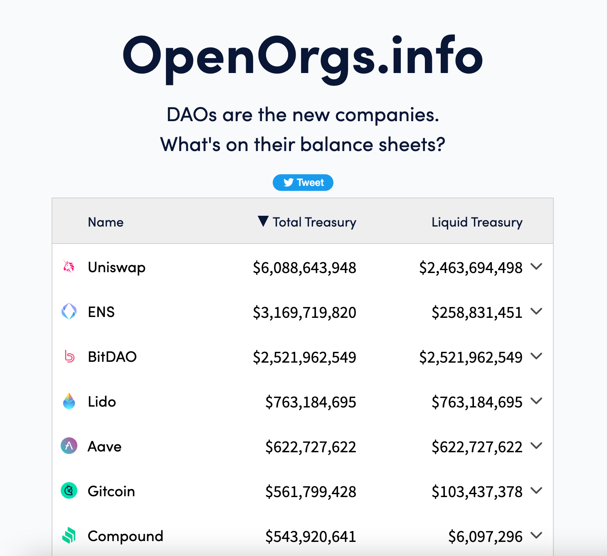
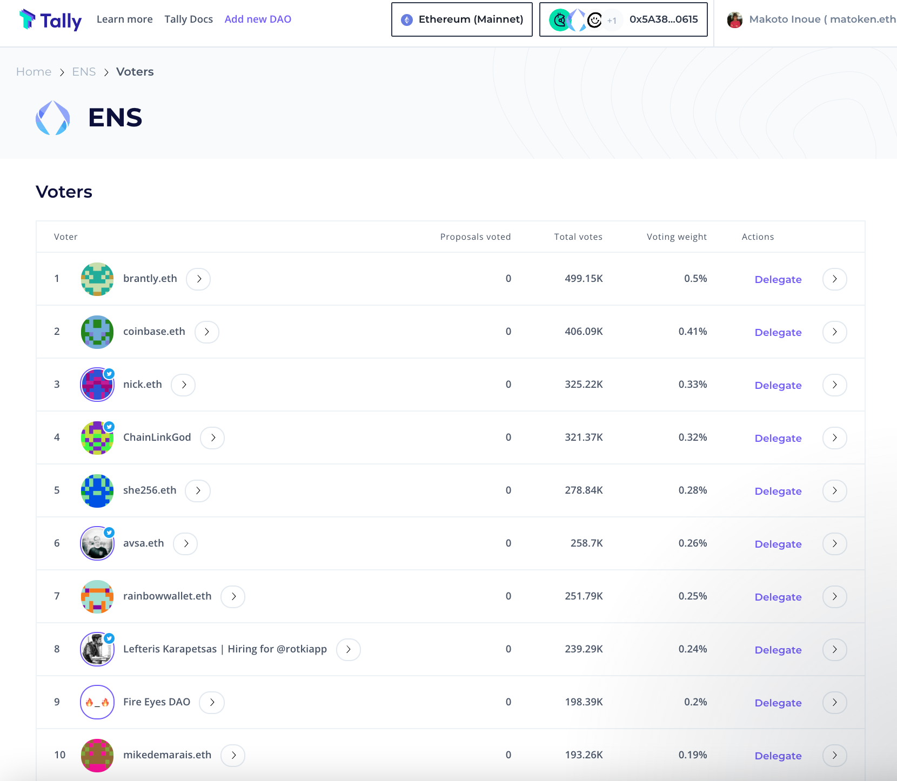
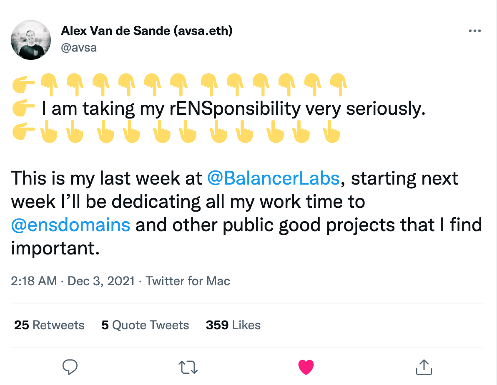

サービスの概要
DAO化の背景
法人格
トークン配布方法
ENS憲法
トークン使用方法と委任制度
DAOへの権限移譲
ENS DAO のこれから

## 初めに

[https://openorgs.info/](https://openorgs.info/)より

2021年11月にローンチしたENS DAOは2022年に行われたUniswapに次ぐ規模のDAOといっても良いでしょう。13万人を対象にエアドロップが行われ、2万4千人以上がガバナンス投票に参加、DAOが保有する（ENSトークンを含む）資産の総額は2021年12月の時点で30億ドルにのぼります。この章ではENSのコアメンバーである筆者が内部の視点から、いかにサービスのDAO化を推し進めていったかについて述べていきます。

## サービスの概要

ENS（Ethereum Name Service）は16進数の羅列であるイーサリアムアドレスにmatoken.ethといった分かりやすい名前を紐付けることができるサービスです。イーサや他の暗号通貨を送るためだけでなく、Dweb（Decentralised Web。IPFSなどを使った分散サイト）の名前に使ったり、異なったマーケットプレースなどでも表示可能なWeb3ユーザーネームとしても使われています。

サービスの沿革は以下の通りです

- 2016年 Ethereum Foundation のコア開発者であるNick Johnson により開発を開始
- 2017年5月 メインネットリリース
- 2018年 Ethereum Foundationより100万ドルの助成金を受け True Names Limitedというシンガポールの会社として独立
- 2019年5月　ENSをERC721互換のNFTにアップグレード
- 2019年9月　OpenSeaにてショートネーム（3〜6文字）のオークションを行い、100万ドル相当を調達
- 2021年の11月にDAO化をアナウンス

イーサリアム上で現存する最古のプロジェクトの一つであり、ERC721といったNFT規格が立ち上がる以前から存在した最古のNFTプロジェクトの一つでもあります（最古のNFTプロジェクトとして有名なCrypto Punksより１ヶ月ほど早くサービスを開始しました。）

DAO化アナウンス前の時点で40万件程度の名前が13万アドレスに所有されていました。また300近いウォレットや取引所、Dapps（Decentralised App）に統合されていました。

コードは全てオープンソース化されており、誰もがコピー、改変可能です。実際2〜3のコピープロジェクトが存在していますが、それらは300近く統合されたDappsからは使えないため実質あまり実用性がありません。より多くの人が使い、多くのシステムに統合されて初めて価値が出てくる極めてネットワーク効果が高いプロジェクトと言えるでしょう。コアなユーザーは自分のSNSのプロファイル名を.ethにするなどイーサリアムのエコシステムに密接に関わっています。

## DAO化の背景

ENSは階層的に所有権が定義されており、matoken.ethの所有者がartist.matoken.ethといったように新たにサブドメインを作成し、アドレスの紐付けをすることができます。サブドメインの所有権は親ドメインに属します。そのため皆さんが登録できる「.eth名」はルートドメインの管理下におかれます。そしてENSがスタートした時からルートドメインは七人の有識者（ENS開発チームからはNick Johnsonのみ）によって管理されており、過半数の同意によってアップグレード可能な作りになっています。以前はこの７名の過半数同意があれば任意のドメインの所有権の上書きが可能でしたが、それは現在は不可能なようにスマートコントラクトを変更しています。

１０人未満にプロトコルのアップグレード権を委ねる方法は他の多くのプロジェクトでも取り入れられている手法で、セキュリティの微弱性が発見したときに素早くプロトコルのアップグレードを可能にする一方、中央集権的という批判も受けてきました。

プロジェクト開始当時から、DAOのような分散組織へ移行するべきかの議論が、年次に開催されていた開発者会議「ENSワークショップ」で毎年のように議題にはあがっていました。しかしながらDAO化のためのツールが未発達であった上、「トークンの敵対的買収などからどうやって防衛するか」という懸念があり、常に早急な分散化には慎重な姿勢でした。

しかしながら2021年のDefiSummer（Decentralised Govenance）プロジェクトのDAO化に伴い関連ツールやサービスが充実するとともに、2021年のJpeg SummerによるNFTの人気化に伴い、NFTの老舗であり、Web3ユーザーネームとしてENSの人気が2021年の春頃から再燃しました。これにより主な収益である.ethドメインの年間登録料（年5ドル相当のイーサ）により月間収入がDAO化前の月で200万ドル(登録アドレス数2〜3万)をうわまわるまで成長し、ENSのスマートコントラクト自身に2000万ドル相当のイーサが蓄積するまでになり、この収益の配分に関しても小さなチーム（当時フルタイムで働いていたチームメンバーは4名程度）で決断するには重荷になってきました。ENS立ち上げに受け取ったのと同規模の70万ドル相当のイーサを2021年5月にGitcoinというクラウドドネーションプラットフォームに寄付はしたのですが、もっとENSエコシステムの発展に有意義に登録料収入を割り振る必要も出てきました。

同年5月にGitcoinがトークンを立ち上げたのはENS自身のトークン立ち上げにも非常に参考になりました。GitcoinはDefiレンディングプラットフォームであるCompoundの代議員制度（Delegation）という仕組みを使っています。Delegationは一般のトークンホルダーが、自分が信用する第三者に投票権をが委任（Delegate）する仕組みで、多くのDefiプロジェクトでも採用されているのですが委任すること自体にガス代がかかるため代議員制度の利用率自体が低くなりがちです。Gitcoinではこの問題を解決するために事前に「スチュワード」という制度を設け、コミュニティで活躍する40〜50名程度の人々に勧誘を呼びかけていました（筆者もGitcoin上で寄付を受けたり、仕事の依頼を昔からしていた経緯からスチュワードになるよう依頼を受けました）。そしてトークンをクレームする時点で投票権を委任をしなければトークンをもらえないような設計になっていました。そのことにより委任率を最初から高くすることにし、プロポーザルに対する高い投票率を実現しています。

Gitcoinプロジェクトの共同創業者であるScott Moorと著名DefiプロジェクトであるAave, YarnやソーシャルトークンプロジェクトであるFriends With Benefits, Forefront, コレクターDAOであるPleasrDAOのDAOアドバイザーとして活躍するFireEyesDAOをアドバイザーに迎え、2021年に入ってから具体的にDAO化とトークン配布の計画を立てました。

## 法人格

ENSの開発チーム自体はイギリス、台湾、米国、ニュージーランドなど世界中に散らばっています。開発チームはシンガポールにある「True Names Ltd」に帰属しています。

法人格のないDAOというのは多く存在するのですが、ENSのDAO自体は[ケイマン諸島に”The ENS Foundation”](https://docs.ens.domains/v/governance/the-ens-foundation)設立されています。設立の理由は3点あり

-  DAOの参加者に対し有限責任を提供する。法人格が存在しない場合DAOが行ったアクションに対して個人責任が生じる可能性がある
- タックス要求に対する準拠が可能になる。法人格が存在しない場合、 DAOが保有する資産に対してアクセス権のない場合でもDAOの収入に対して DAO参加者が責任を追求される可能性がある。
- 「実世界」の企業と契約を結ぶのを可能とする

とあります。逆にいうとDAOの法人格が地球上のどこにも存在しない場合、いろいろな国から「その DAOは我が国に属するから我が国の基準に従って税金払ってね」と言われる可能性からDAO参加者を保護することを意図しているとも言えます。

なおケイマン諸島は法人の所得税、キャピタルゲイン税に関して非課税になっています。

## トークン配布方法

ENSトークンの目的は既存のユーザーにENSのガバナンスに参加する手段を提供するためのものです。
これまでの貢献者やユーザーに半分のトークンを割り当て、これから参加するであろう将来の貢献者のためにDAOが残りの半分を管理するような配分になっています。

[$ENS Token Allocation](https://ens.mirror.xyz/-eaqMv7XPikvXhvjbjzzPNLS4wzcQ8vdOgi9eNXeUuY)より

4分の1はENSの.eth名の保持者にエアドロップされ、残りはコントリビューターに配分されました。コントリビューターは現在のチームメンバーだけではなく、ENSが法人化する前にローンチを手伝ってくれた人々や過去のチームメンバー、ENSを初期からサポートした100に渡るチーム、そしてサイトの翻訳者やDiscordでアクティブに参加している人たちらが含まれました。筆者を含むコアチームメンバーは将来4年間に渡り、徐々にトークン引き出し可能なようになっており、 DAO誕生当初は他のユーザーと同等にENSの使用に応じ配布されたトークンしか持っていませんでした。

なおコントリビューターに関して特筆するべき点は、投資家が含まれていないことです。

通常のプロジェクトの多くはトークンをローンチする前からSAFT（Simple Agreement of Future Token）契約などを結び、投資家がある程度の価格でトークンを保持している場合があります。

しかしながらENSはEthereum Foundationからの助成金と2019年に行ったショートネームのオークション売上のみを資金源として運営されており、ローンチ時点では投資家が全くいない状態でした。

よってトークンの内部価格というものは全く存在しませんでしたし、多くの取引所から流動性供給の依頼が来たのですがチーム自体は流動性はほぼ持っておらず、エアドロップでトークンを受け取った参加者がUniswapなどの分散取引所に流動性を供給することでトークン価格は形成されました。よくトークンローンチの時点でプロジェクト開始期に安くトークンを買った投資家が上場時に一般ユーザーに高値で売りつけると批判されうことが多いですが、その点でENSのローンチはかなりフェアローンチの部類に入るのではないでしょうか。

実際のユーザーへのトークン配分ですが名前の数に応じて配布されたのではなく、各アドレスがもっとも長く保持している名前の過去と将来の保持期間に応じて配布されました。そしてプライマリーネームというアドレスを名前に逆に紐づける機能を使っていたユーザーはトークン数が倍になるようにも設定されていました。

具体的には

`0.27 * (過去のENSの保有日)+0.062 * (将来のENSの保有日) * 2 (もしプライマリーネームを設定していたら)`

という数式になります。

なので2017年のローンチ当初から持っている名前をトークンアナウンス時から将来8年以上の期限を伸ばしていたユーザーのアドレスに最もトークンが配布されました。

なぜこのような配布にしたかというのは理由が3点あります。

1点目は「スクワッター」と言われるユーザーに大量の議決権を与えるのを避けるためです。

インターネットの世界で一番最初に登場したサービスであるDNSの世界では特定の名前に対する居座り（サイバースクワット）が大きな問題です。ENSの世界でも将来のENS名の価格上昇を見込み大量の名前を使う予定もないのに所持している人がたくさんいます。実際に1アドレスで1000以上のENSを保持している場合もあり、そういった少数のスクワッターに参政権を多く与えると、ENSのユーティティーを高めるよりも、ENSのNFTとして価値最大化ばかりを高めるような施策に偏るのを避けたかったためです（スクワッターの中からは「なんでENSに先行投資した人を優遇しないんだ」という批判的な意見も上がりました）。

2点目はいわゆるトークンファーミングを阻止するためです。前述した方法だとあらかじめトークンのエアドロップを予測して大量の別アドレスにENS名を移すという手段を選ぶ人が出てきます。実際にトークン配布を発表した後、トークン配布まで1週間ほど間が空いていたのですが、その間に1000〜2000というアカウントから明らかにENS名を登録しただけのアドレスが見つかったので、それらをエアドロ対象外にする措置が取られたのですが完璧ではなかったと思います。たとえそういう人たちが大量に存在したとしても、エアドロを見越して3年前からアドレスを分散したり、長期にわたって名前を登録するのはかなりコストがかかってしまうからです。

3点目がもっとも重要な点ですが、ENSローンチからずっと名前を保持し、そして長期にわたって名前を保持する意思のあるユーザーにより多くガバナンスに参加して欲しいという意図がありました。もちろんトークンには価格がつくのでそれを売ることを止めることはできませんが、ENS名を長期に保有している人の方がENSトークンを同様に保持する傾向があるのではという狙いもありました。

トークン配布期間は6ヶ月間で、claim.ens.domainsからクレーム可能です。トークン配布から1ヶ月経った時点で70％以上のトークンがクレームされました。保有アドレス数は13万7千のうち9万アドレスに及びます（67％）。

## ENS憲法

ENSトークン配布でユニークだったのは「ENS憲法」というENS DAO運営の基本ポリシーをなすものが4点あり、トークンをクレームする時点で各自どの項目に賛同するか否かを投票しなければいけなかった点です。

実際の[ENS憲法](https://docs.ens.domains/v/governance/ens-dao-constitution)は以下のようになります。

### 1.名前の所有権を侵害されてはならない

ENSガバナンスはENSユーザーの所有権を侵害してはならず、ユーザーが所有権を延長したり移転することを妨げてはならない。例えばENSガバナンスが名前の長さや保有期間といった客観的に判断できる基準での登録料の変更をすることはできるがすでに延長した保有期間の短縮や特定の団体に不利益を被るような変更をしてはならない。

### 2.　登録料はインセンティブメカニズムとして存在する

登録料は投機的目的で大量の名前を保持しようとすることを妨げることを目的としてえ存在する。二時的な意味でENSプロトコルの開発のために必要な十分な予算を確保するために使用されても良いがそれ以外の目的のために課金してはならない。
例えば健在の登録料が投機的目的を防ぐには安すぎると判断した場合に登録料を値上げするとは可能だが、.eth以外のドメイン名（ユーザーがexample.comというドメイン名を所有していた場合.comとENS名として使うことができる）に課金するのは収入以外の理由がないのでしてはならない。

### 3.　登録料収入はENSや他の公共財のために使われるべきである

ENS内で発生した資産はまずはENSの長期にわたる発展に使われるべきであり、その次に他のWeb3内での公共財の発展に使われるべきである。逆に言えばENSの発展と利害衝突するようなことに使われるべきではない。

### 4.　ENSは既存のグローバルなネームスペースを尊重する

ENSが将来にわたって最も使われるシステムになるために既存のインターネットネームシステム（DNS）を尊重する。もし将来（.xyzといった）インターネットドメインの管理会社が自分のトップレベルドメインを個別管理したいと申し出た場合はその権利を譲渡するべきだが現存しないトップレベルドメインを勝手に作ってはならない

（筆者注：「.eth はどうなるんだ？」とお考えの方もたくさんいると思います。.ethといった３文字のドメイン名は実際はエチオピアのために保管されているネームスペースですがエチオピアは.etを使っているため、将来名前衝突の可能性が低いからまあ大丈夫だろうというのがENSチーム内での見解です）

実際の投票方法っですがメタマスクといったウォレットで電子署名した後はシステムの裏でもsnapshot投票が行われました。

[Ratification of the ENS DAO Constitution](https://snapshot.org/#/ens.eth/proposal/0xd810c4cf2f09737a6f833f1ec51eaa5504cbc0afeeb883a21a7e1c91c8a597e4)より

憲法に対する投票は一週間かけて行われ2/3の賛成票が必要でした。結果は全ての項目が90％近くの同意を得ることができました。
この結果がオンチェーンでの拘束力を持つわけではありませんが、ガバナンスフォーラムで行われる議論は大体、この憲法の項目に沿っているか否かが議論されています。

この憲法自体が改正されるためには過半数でなく2/3の同意が必要となってきます。

## トークン使用方法と委任制度

前述した通りENSトークンはガバナンスのためにのみ存在するトークンです。ENS DAOに提案するには10万トークンが必要であり、各提案に対する投票はトークン量に応じて決まります。議決が通るには少なくとも全トークンの1％にあたる投票数が必要です（トークン総数は100億なので最低得票数は1億となります）。トークンは最も多く受け取った人でも1アドレス当たり1000トークンほどなので、提案するためには大量のトークンを買う必要がありそうですが、実際にはユーザーがトークンをクレームする時点で自分の投票権を他者に委ねる「委任」という制度をとっています。

[https://www.withtally.com/governance/ens/voters](https://www.withtally.com/governance/ens/voters)より

執筆時の20201年12月の時点では上位15名が DAOに決議を提案するだけのトークンが委任されているようです。

よく「委任になるには何票必要ですか」と聞かれるのですが特に下限はありません。基本的には任意のENS名から委任する対象を選ぶことができるのですが、トークンクレーム時には委任立候補分をフォーラムに投稿し、その投稿URLをENSのテキストレコードに保存した人だけクレームページに表示されるようにしました。立候補時間はトークンローンチのアナウンスをしてから1週間だったにも関わらず700人近い人が立候補しました。

[https://claim.ens.domains/delegates](https://claim.ens.domains/delegates)より

トークン配布直後にチーム内の懸念としてあったのは「トークン買い占めによるガバナンス権の乗っ取り」でした。特にトークンが配布された直後はトークン価値はゼロだったため、いったいトークンの経済的価値がどれぐらいになるかも、提案を可決するのに必要な投票分のトークンを購入する、またはトークンを委任してくれた人に対して見返りを提供する（いわゆる賄賂）ことも可能でしたし、実際に「私たちに委任してくれたらENSトークンをあげるよ」と言っていた候補者も見受けられました。

もしこの時点で明らかに悪意がありそうな参加者が多数派を握った場合どうするべきだったでしょうか？
一つ（そして多分唯一の方法）はENSチームがDAOへの参加を拒否してENSトークンそのものを破棄するという考えが挙げられます。

トークン配布時では全体の２5％がENSユーザーに配布されていましたが、DAOが保持する予定の残りの5０％はその時点ではENSチームの管理化にありました。
ENSスマートコントラクトの管理権限と今までの.ethの登録料は前述したルートマルチシグアカウントの管理を任せられている７人に帰属していました。なのでこの段階ではまだDAO自体がプロトコルに対する意思決定をすることはできません。
そしてENSトークンの２5％がENSユーザーに配布されていましたがDAOが保持する予定の残りの5０％はその時点ではENSチームの管理化にありました。なのでENSトークンを買い占めした参加者が「残りの5０％のトークンを私に下さい」というプロポーザルを出してもENSチームが拒否すればどうしようもない状態でした。しかしながらもしそういった自体に陥った場合はENSのトークンの信用は地に落ちてしまい、新たにトークンを再発行しても現在のような信用力を得ることは難しかったでしょう。

幸いにも委任リストの上位はイーサリアムとENSエコシステムの有識者で占められました。
ENSチームからはクリエータであるnick.ethとチームメートのbrantley.ethがトップ5に入る健闘を見せました。そのほかのトップ10の顔ぶれとしてはENSローンチメンバーでもとEthereum Foundationでニックと同量であったAvsa.eth、ローンチアドバイザーであるFire Eyes DAO、 匿名ツイッターインフルエンサーのChainLinkGod 、ENSを初期からサポートしているRainbow walletとその創業者であり著名人に.ethを上げることで有名なmikedemarais.eth、そして他の DAOでも活発に活動しているLefteris  Karapetsasらがいます。結構以外だったのが仮想通貨取引所であるCoinbaseがSNSアカウントからも積極的にcoinbase.ethへの委任をアピールし、2位の位置付けになっていることです。これからCoinbaseがどのようにENS  DAOに関わっていく予定なのか大変興味があります。

そしてこれが重要なのですが委任あたりの投票力の分散化です。一位のbrantly.ethも0.5%程度しか投票権がないため、少数の委任が一人の得票だけで結果を決めるのが難しくなっています。

## DAOへの権限移譲

ENS憲法が可決された次に出された法案はENSが保持している資産と権限のDAOへの委譲です。

”[[Social] Proposal: Transfer ENS Treasury and Contract Ownership”（ENS資産とスマートコントラクト管理権限の委譲）](https://snapshot.org/#/ens.eth/proposal/0xfe73d1b06675d6bc1cc074f440c347274d13c55b513ea02ec950efe639adbbb0)と題された法案はトークンローンチのアドバイザーであるFire Eyes DAOから出されました。

ENSは2019年の5月にアップグレードを行なった際に.ethの登録料の徴収が始まり、12月15日現在で[14,372ETH](https://dune.xyz/makoto/dot-eth-revenue)の収入を上げています。そのうちの180ETHは5月にGitcoinに寄付したのですが、残りは以下のアドレスにあります。

- multisig.ensdao.eth = 4369 ETH + 10M USDC　マルチシグが管理するENS資産
- controller.ens.eth = 5498 ETH　名前登録を司るスマートコントラクト

ちなみにENSが保持する資産は全てイーサリアム上にあるのでDuneAnalyticsと言ったツールを使ってリアルタイムダッシュボードなどを作ることが可能です。

今回の提案ではまずmultisig.ensdao.ethにある資産の全てをDAOが管理するTimeLockコントラクトであるwallet.ens.ethに移管し、controller.ens.ethとそのほかのいくつかのスマートコントラクトの所有権をDAOコントラクトに移管します。

このプロポーザルも過半数の得票を得て採択され、ENS資産に関してはすでに移管は完了しました。

[Gnosis Safe](https://gnosis-safe.io/app/eth:0xCF60916b6CB4753f58533808fA610FcbD4098Ec0/transactions/history)より

その様子もこのようにGnosis Safe ウォレットから履歴を辿ることができます。

## ENS DAO のこれから

こうして資産やスマートコントラクトの管理権限がDAOに以上されていったのですが、ENS DAOがENSの発展にどれぐらい寄与するかは今後トークンホルダー達がどれだけ活発にガバナンスに関与してくるかにかかってきます。

DAOによってさまざまな管理形態がとられていますが、ENSでは現在「ワーキンググループ制度」というのを[提案](https://snapshot.org/#/ens.eth/proposal/0x899ead1d9b9b98f63f6a60dc0939bef55dbe365e78c6a550f07be969a47f148b
)しています。これは各提案を一つ一つ投票にかけるのではなく、以下の四つの「ワークストリーム」というグループごとに予算投票し、実際にどのプロジェクトに予算を割り当てるかはワークストリームごとに委ねるというモノです。

- 1 メタガバナンス
- 2 ENSエコシステム
- 3 コミュニティ
- 4 公共財

各ワーキンググループを管理するために５人のスチュワードを置き６ヶ月ごとに再選します。最初の６ヶ月は立ち上げ期ということもあって、ENSチームが２人づつ、二期目は一人づつ、そして１年後からは全てENSのコミュニティメンバーで運営する予定になっています。

スチュワードの任務期間は、時間数に応じで給料を払う予定ですが、実際にいくら払われるかについてはこれから決めていくようです。

ワーキンググループ制度は前述したGitcoinのDAOで行われていたので採用しました。ENSチームのコミュニティマネジャーであり、Gitcoin DAOでも活躍するalisha.ethのアイデアです。彼女はトークンローンチの２ヶ月ほど前にジョインしたメンバーですが、彼女がDiscordサーバーのチャンネルやロールを整理し、新規に入ったコミュニティメンバーを歓迎するためのシステム作りをしてくれたことはENSのトークンローンチに対して必須だったと言えるでしょう。

彼女はもともと自分のポッドキャストを持っていたのですが、Nickをゲストに招いた時に逆にメンバーとして勧誘されたそうです。

またトークンローンチが始まってから６万近い新規アカウントがDiscordサーバーに殺到しました。ボットも多くいたのですが、実際のユーザーも大量にジョインしトークンローンチの１〜２週間は質問に対応することでチームは忙殺されました。しかしながらコミュニティーのメンバーの中から自発的に新規ユーザーの質問に答えてくれるボランティアも出現し始め、その中の何人かはパートタイムやフルタイムのメンバーとして採用することにもつながりました。

ENSはイーサリアム上で存在する最古のプロジェクトの一つで、日頃からカンファレンスなどに出た際「ENSのファンだよ」といってくれる人は多くいたのですが、実際にENSの日々の活動に関わってくれる人は皆無だったといって良いでしょう。
トークンローンチを境にコミュニティメンバーとして参加し始めた人が増えたのは大変喜ばしいことです。ENSプロジェクトの初期メンバーでありトークン代議員トップ１０に入るavsa.ethは先日、所属するbalancer labを退職してDAOをメインに活動すると宣言しました。

[avsa.eth](https://twitter.com/avsa/status/1466456672818417664)ツイートより

しかしながらトークンを得た見返りとして自主的に参加しているメンバーがDAOのワークストリームを通じて正当な対価を受けながら持続的に参加してくれるかどうかはこれからのDAOガバナンスにかかっています。

