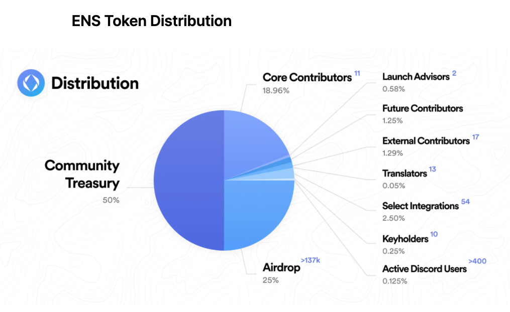
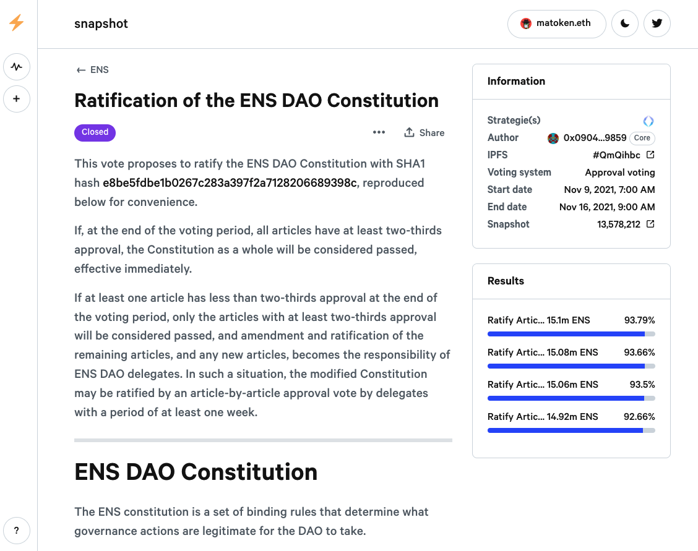
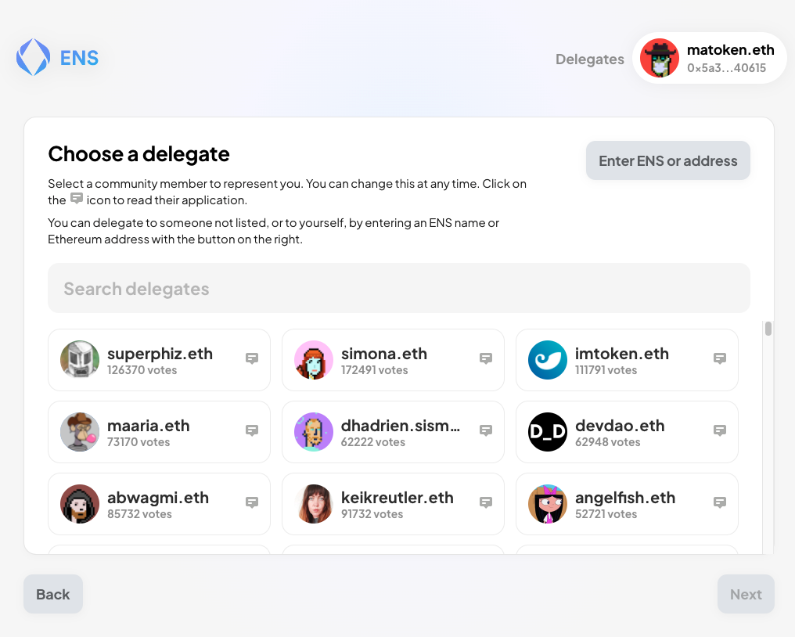
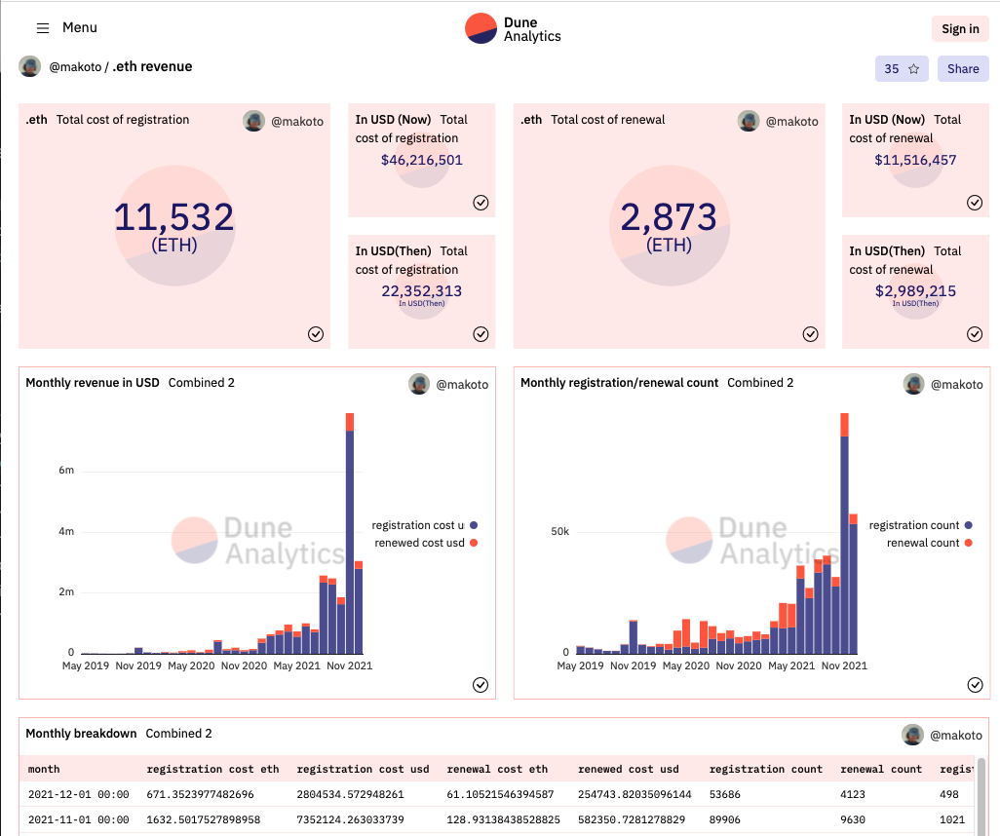
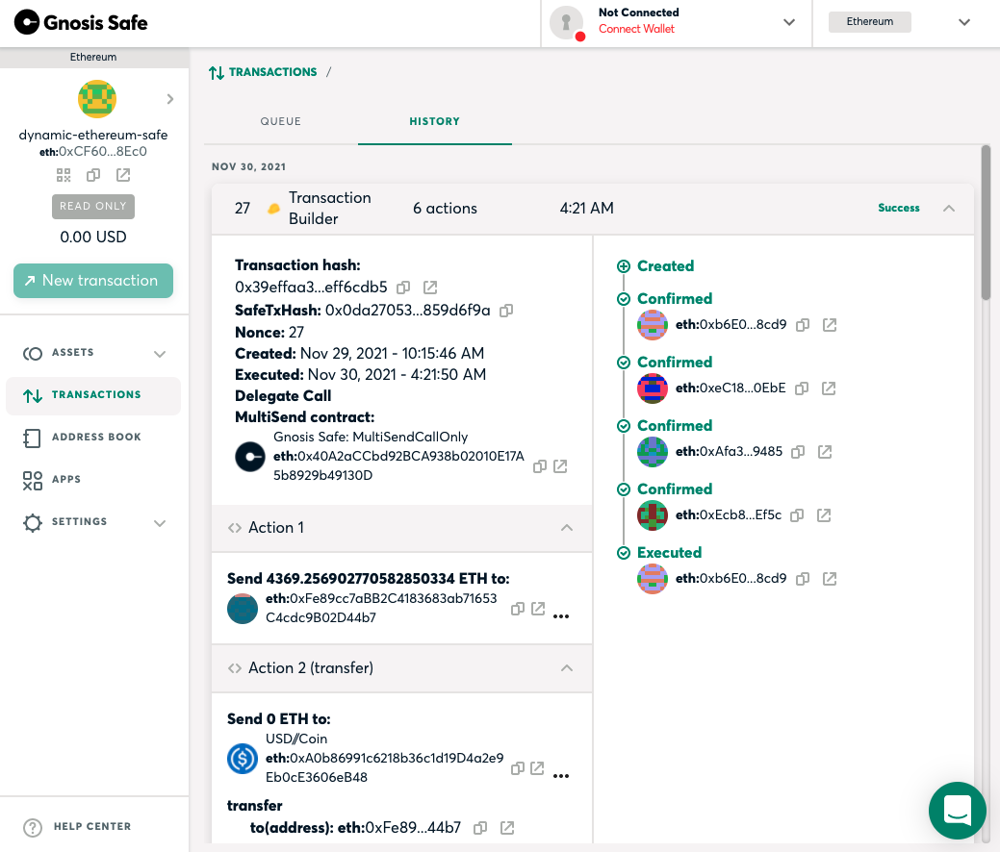

- サービスの概要
- DAO化の背景
- トークン配布方法 -
- ENS憲法とガバナンスの仕組み
- 今後の課題

## サービスの概要

ENS（Ethereum Name Service）は１６進数の羅列であるイーサリアムアドレスにmatoken.ethといった分かりやすい名前を紐付けることができるサービスです。イーサや他の暗号通貨を送るためだけでなく、Dweb（Decentralised Web。IPFSなどを使った分散サイト）の名前に使ったり、異なったマーケットプレースなどでも表示可能なWeb3ユーザーネームとしても使われています。

サービスの沿革は以下の通り

- ２０１６年 Ethereum Foundation のコア開発者でエアルNick Johnson により開発を開始
- ２０１７年５月 サービスを立ち上げ
- ２０１８年 Ethereum Foundationより百万ドルの助成金を受け True Names Limitedというシンガポールの会社として独立
- ２０１９年５月　ENSをERC721互換のNFTにアップグレード
- ２０１９年９月　OpenSeaにてショートネーム（３〜６文字）のオークションを行い、百万ドル相当を調達
- ２０２１年の１１月のDAO化をアナウンス

イーサリアム上で現存する最古のプロジェクトの一つであり、ERC721といったNFT規格が立ち上がる以前から存在した最古のNFTプロジェクトの一つでもあります（最古のNFTプロジェクトとして有名なクリプトキティより１ヶ月ほど早くサービスを開始しました。）

DAO化アナウンス前の時点で４０万件程度の名前が１３万アドレスに所有されていました。また３００近いウォレットや取引所、Dapps（Decentralised App）に統合されていました。

コードは全てオープンソース化されており、誰もがコピー、改変可能であり、実際２〜３のコピープロジェクトが存在していますが、コピープロ, ジェクトは３００近く統合されたDappsからは使えないため、極めてネットワーク効果が高いプロジェクトです。コアなユーザーは自分のSNSのプロファイル名を.ethにするなどイーサリアムのエコシステムとっも密接に関わっています。

## DAO化の背景

ENSは階層的に所有権が定義されており、matoken.ethの所有者がartist.matoken.ethといいったように新たにサブドメインを作成し、アドレスの紐付けをすることができます。サブドメインの所有権は親ドメインに属します。そのため皆さんが登録できる.eth名はルートドメインの管理下におかれます。そしてENSがスタートした時からルートドメインは七人の有識者（ENS開発チームからはNick Johnsonのみ）によって管理されており、過半数の同意によってアップグレード可能な作りになっています。以前はこの７名の過半数同意があれば任意のドメインの所有権の上書きが可能でしたが、それは現在不可逆的に不可能なようにスマートコントラクトを変更しています。

１０人未満にプロトコルのアップグレード権を委ねる方法は他の多くのプロジェクトでも取り入れられている手法で、TheDAOのようなセキュリティの微弱性（TODO：前章で説明予定）が発見したときに素早くプロトコルのアップグレードを可能にする一方、中央集権的という批判も受けてきました。

プロジェクト開始当時からいずれはDAOのような分散組織への議論が、年次に開催されていた開発者会議「ENSワークショップ」で毎年のように議題にはあがっていました。しかしながらDAO化のためのツールが未発達であった上、「トークンの敵対的買収などからどうやって防衛するか」という懸念があり、常に早急な分散化には慎重な姿勢でした。

しかしながら２０２０年のDefiSummer（Decentralised Govenance）プロジェクトのDAO化（TODO：前章で説明予定）に伴い関連ツールやサービスが充実するとともに、２０２１年のJpeg Summer（TODO：前章で説明予定）によるNFTの人気かに伴い、NFTの老舗であり、Web3ユーザーネームとしてENSの人気が２０２１年の春頃から再燃しました。これにより主な収益である.ethドメインの年間登録料（年五ドル相当のイーサ）により月間収入がDAO化前の月で２００万ドル(登録数２〜3万)をうわまるまで成長し、ENSのスマートコントラクト自身に２０００万ドル相当のイーサが蓄積するまでになり、この収益の配分に関しても小さなチーム（当時フルタイムで働いていたチームメンバーは４名程度）で決断するには重荷になってきました。ENS立ち上げに受け取ったのと同規模の７０万ドル相当のイーサを２０２１年５月にGitcoinというクラウドドネーションプラットフォームに寄付はしたのですが、もっとENSエコシステムの発展に有意義に登録料収入を割り振る必要が出てきました。

同年５月にGitcoinがトークンを立ち上げたのはENS自身のトークン立ち上げにも非常に参考になりました。GitcoinはDefiレンディングプラットフォームであるCompound（TODO：前章で説明予定）の「Delegation」という仕組みを使っています。Delegationは一般のトークンホルダーが、自分が信用する第三者に投票権を委譲する仕組みで、多くのDefiプロジェクトでも採用されているのですがDelegateすること自体にガス代がかかるためDelegationの利用率自体が低くなりがちです。Gitcoinではこの問題を解決するために事前に「Steward」という制度を設け、コミュニティで活躍する４０〜50名程度の人々に勧誘を呼びかけていました（筆者もGitcoin上でドネーションを受けたり、仕事の依頼を昔からしていた経緯からSteward依頼を受けました）。そしてトークンをクレームする時点で投票権を委任するDelegateをしなければトークンをもらえないような設計になっていました。そのことによりDelegate率を最初から高くすることにし、プロポーザルに対する高い投票率を実現しています（TODO:実際の投票率確認する必要あり）。

Gitcoinプロジェクトの共同創業者であるScott Moorと著名DefiプロジェクトであるAave, YarnやソーシャルトークンプロジェクトであるFriends With Benefits, Forefront, コレクターDAOであるPleasrDAOのDAOアドバイザーとして活躍するFireEyesDAOをアドバイザーに迎え、２０２１年に入ってから具体的にDAO化とトークン配布の計画を立てました。

## 法人格

ENSの開発チーム自体はイギリス、台湾、米国、ニュージーランドなど世界中に散らばっています。開発チームはシンガポールにある「True Names Ltd」に帰属しています。

法人格のないDAOというのは多く存在するのですが、ENSのDAO自体は[ケイマン諸島に”The ENS Foundation”](https://docs.ens.domains/v/governance/the-ens-foundation)設立されています。設立の理由は3点あり

-  DAOの参加者に対し有限責任を提供する。法人格が存在しない場合DAOが行ったアクションに対して個人責任が生じる可能性がある
- タックス要求に対する準拠が可能になる。法人格が存在しない場合、 DAOが保有する資産に対してアクセス権のない場合でもDAOの収入に対して DAO参加者が責任を追求される可能性がある。
- 「実世界」の企業と契約を結ぶのを可能とする

とあります。逆にいうとDAOの法人格が地球上のどこにも存在しない場合、いろいろな国から「その DAOは我が国に属するから我が国の基準に従って税金払ってね」と言われる可能性からDAO参加者を保護することを意図しているとも言えます。

なおケイマン諸島は法人の所得税、キャピタルゲイン税に関して非課税になっています（TODO: もうちょっと詳しく調べるべき）。

## トークン配布方法

ENSトークンの目的は既存のユーザーにENSのガバナンスに参加する手段を提供するためのものです。
これまでの貢献者やユーザーに半分のトークンを割り当て、これから参加するであろう将来の貢献者のためにDAOが残りの半分を管理するような配分になっています。

[$ENS Token Allocation](https://ens.mirror.xyz/-eaqMv7XPikvXhvjbjzzPNLS4wzcQ8vdOgi9eNXeUuY)より

4分の1はENSの.eth名の保持者にエアドロップされ、残りはコントリビューターに配分されました。コントリビューターは現在のチームメンバーだけではなく、ENSが法人化する前にローンチを手伝ってくれた人々や過去のチームメンバー、ENSを初期からサポートした100に渡るチーム、そしてサイトの翻訳者やDiscordでアクティブに参加している人たちらが含まれました。筆者を含むコアチームメンバーは将来4年間に渡り、徐々にトークン引き出し可能なようになっており、 DAO誕生当初は他のユーザーと同等にENSの使用に応じ配布されたトークンしか持っていませんでした。コントリビューターに関して特筆するべき点は投資家が含まれていないことです。

通常のプロジェクトの多くはトークンをローンチする前からSAFT（Simple Agreement of Future Token）契約などを結び、投資家がある程度の価格でトークンを保持している場合があります。

しかしながらENSはEthereum Foundationからの助成金と2019年に行ったショートネームのオークション売上のみを資金源として運営されており、ローンチ時点では投資家が全くいない状態でした。

よってトークンの内部価格というものは全く存在しませんでしたし、多くの取引所から流動性供給の依頼が来たのですがチーム自体は流動性はほぼ持っておらず、エアドロップでトークンを受け取った参加者がUniswapなどの分散取引所に流動性を供給することでトークン価格は形成されました。よくトークンローンチの時点でプロジェクト開始期に安くトークンを買った投資家が上場時に一般ユーザーに高値で売りつけると批判されうことが多いですが、その点でENSのローンチはかなりフェアローンチ（TODO：前章で説明）の部類に入るのではないでしょうか。

実際のユーザーへのトークン配分ですが名前の数に応じて配布されたのではなく、もっとも長く保持している名前の過去と将来の保持期間に応じて配布されました。なので2017年のローンチ当初から持っている名前をトークンアナウンス時から将来8年以上の期限を伸ばしていたユーザーのアドレスに最もトークンが配布されました（そしてプライマリーネームというアドレスを名前に逆に紐づける機能を使っていたユーザーはトークン数が倍になるようにも設定されていました）。

なぜこのような配布にしたかというのは理由が3点あります。

1点目は「スクワッター」と言われるユーザーに大量の議決権を与えるのを避けるためです。

ENSと類似したサービスを提供するDNS（インターネットドメイン）の世界では特定の名前に対する居座りが大きな問題です。ENSの世界でも将来のENS名の価格上昇を見込み大量の名前を使う予定もないのに所持している人がたくさんいます。実際に1アドレスで1000以上のENSを保持している場合もあり、そういった少数のスクワッターに参政権を多く与えると、ENSのユーティティーを高めるよりも、ENSのNFTとして価値最大化ばかりを高めるような施策に偏るのを避けたかったためです（スクワッターの中からは「なんでENSにお金をたくさん落とした人を優遇しないんだ」という批判的な意見も上がりました）。

2点目はいわゆるトークンファーミングを阻止するためです。前述した方法だとあらかじめトークンのエアドロップを予測して大量の別アドレスに
ENS名を移すという手段を選ぶ人が出てきます。実際にトークン配布を発表した後、トークン配布まで1週間ほど間が空いていたのですが、その間に1000〜2000というアカウントから明らかにENS名を登録しただけのアドレスが見つかったので、それらをエアドロ対象外にする措置が取られたのですが完璧ではなかったと思います。たとえそういう人たちが大量に存在したとしても、エアドロを見越して3年前からアドレスを分散したり、長期にわたって名前を登録するのはかなりコストがかかってしまうからです。

3点目がもっとも重要な点ですが、ENSローンチからずっと名前を保持し、そして長期にわたって名前を保持する意思のあるユーザーにより多くガバナンスに参加して欲しいという意図がありました。　もちろんトークンには価格がつくのでそれを売ることを止めることはできませんが、ENS名を長期に保有している人の方がENSトークンを同様に保持する傾向があるのではという狙いもありました。

トークン配布期間は6ヶ月間で、claim.ens.domainsからクレーム可能です。トークン配布から1ヶ月経った時点で70％以上のトークンがクレームされました。保有アドレス数は13万7千のうち9万アドレスに及びます（67％）。

## ENS憲法

ENSトークン配布でユニークだったのは「ENS憲法」というENS DAO運営の基本ポリシーをなすものが4点あり、トークンをクレームする時点で各自どの項目に賛同するか否かをサインしなければいけなかった点です。

実際のENS憲法は以下のようになります。

[TODO: https://docs.ens.domains/v/governance/ens-dao-constitution の要約]

この「サイン」ですが、メタマスクといったウォレットで電子署名した後はシステムの裏でもsnapshot[TODO：前章で説明]投票が行われました。

[Ratification of the ENS DAO Constitution](https://snapshot.org/#/ens.eth/proposal/0xd810c4cf2f09737a6f833f1ec51eaa5504cbc0afeeb883a21a7e1c91c8a597e4)より

憲法に対する投票は一週間かけて行われ、結果は全ての項目が90％近くの同意を得ることができました。
この結果がオンチェーンでの拘束力を持つわけではありませんが、ガバナンスフォーラムで行われる議論は大体、この憲法の項目に沿っているか否かが議論されています。

この憲法自体が改正されるためには過半数でなく2/3の同意が必要となってきます。

## トークン使用方法とデレゲート制度

前述した通りENSトークンはガバナンスのためにのみ存在するトークンです。ENS DAOに提案するには100k分のトークンが必要であり、各提案に対する投票はトークン量に応じて決まります。議決が通るには少なくとも全トークンの1％にあたる投票数が必要です（トークン総数は100ミリオンなので最低得票数は1ミリオン＝100万となります）。トークンは最も多く受け取った人でも1アドレス当たり1200トークンほど（TODO：1200というのは概算なので調べる必要あり）、提案するためには大量のトークンを買う必要がありそうですが、実際にはユーザーがトークンをクレームする時点で自分の投票権を他者に委ねる「デレゲート」という制度をとっています。

[IMAGE:https://www.withtally.com/governance/ens/voters からスクリーンショット]

執筆時の20201年12月の時点では上位15名が DAOに決議を提案するだけのトークンがデレゲートされているようです。

よく「デレゲートになるには何票必要ですか」と聞かれるのですが特に下限はありません。基本的には任意のENS名からデレゲートする対象を選ぶことができるのですが、トークンクレーム時にはデレゲート立候補分をフォーラムに投稿し、その投稿URLをENSのテキストレコードに保存した人だけクレームページに表示されるようにしました。立候補時間はトークンローンチのアナウンスをしてから1週間だったにも関わらず700人近い人が立候補しました。

[https://claim.ens.domains/delegates](https://claim.ens.domains/delegates)より

この間チーム内の懸念としてあったのは「トークン買い占めによるガバナンス権の乗っ取り」でした。特にトークンが配布された直後はトークン価値はゼロだったため、いったいトークンの経済的価値がどれぐらいになるかも、提案を可決するのに必要な投票分のトークンを購入する、またはトークンをデレゲートしてくれた人に対して見返りを提供する（いわゆる賄賂）ことも可能でしたし、実際に「私たちにデレゲートしてくれたら＄ENSトークンをあげるよ」と言っていた候補者も見受けられました。

もしこの時点で明らかに悪意がありそうな参加者が多数派を握った場合どうするべきだったでしょうか？
一つ（そして多分唯一の方法）はENSチームがDAOへの参加を拒否してENSトークンそのものを破棄するという考えが挙げられます。

トークン配布時では全体の２５％がENSユーザーに配布されていましたが、DAOが保持する予定の残りの５０％はその時点ではENSチームの管理化にありました。
ENSスマートコントラクトの管理権限と今までの.ethの登録料は前述したルートマルチシグアカウントの管理を任せられている７人に帰属していました。なのでこの段階ではまだDAO自体がプロトコルに対する意思決定をすることはできません。
そしてENSトークンの２５％がENSユーザーに配布されていましたがDAOが保持する予定の残りの５０％はその時点ではENSチームの管理化にありました。なのでENSトークンを買い占めした参加者が「残りの５０％のトークンを私に下さい」というプロポーザルを出してもENSチームが拒否すればどうしようもない状態でした。しかしながらもしそういった自体に陥った場合はENSのトークンの信用は地に落ちてしまい、新たにトークンを再発行しても現在のような信用力を得ることは難しいでしょう。

幸いにもデレゲートリストの上位はイーサリアムとENSエコシステムの有識者で占められました。
ENSチームからはクリエータであるnick.ethとチームメートのbrantley.ethがトップ5に入る健闘を見せました。そのほかのトップ10の顔ぶれとしてはENSローンチメンバーでもとEthereum Foundationでニックと同量であったAvsa.eth、ローンチアドバイザーであるFire Eyes DAO 匿名ツイッターインフルエンサーのChainLinkGod 、ENSを初期からサポートしているRainbow walletとその創業者であり著名人に.ethを上げることで有名なmikedemarais.eth、そして他の DAOでも活発に活動しているLefteris  Karapetsasらがいます。結構以外だったのが仮想通貨取引所であるCoinbaseがSNSアカウントからも積極的にcoinbase.ethへのデレゲートをアピールし、2位の位置付けになっていることです。これからCoinbaseがどのようにENS  DAOに関わっていく予定なのか大変興味があります。

そしてこれが重要なのですがデレゲートあたりの投票力の分散化です。一位のbrantly.ethも0.5%程度しか投票権がないため、少数のデレゲートが一人の得票だけで結果を決めるのが難しくなっています。

## DAOへの権限移譲

ENS憲法が可決された次に出された法案はENSが保持している資産と権限のDAOへの委譲です。

”[Social] Proposal: Transfer ENS Treasury and Contract Ownership”（ENS資産とスマートコントラクト管理権限の委譲）と題された法案はトークンローンチのアドバイザーであるFire Eyes DAOから出されました。

ENSは２０１９年の５月にアップグレードを行なった際に.ethの登録料の徴収が始まり、１２月１５日現在で[14,372ETH](https://dune.xyz/makoto/dot-eth-revenue)の収入を上げています。そのうちの180ETHは５月にGitcoinに寄付したのですが、残りは以下のアドレスにあります。

- multisig.ensdao.eth = 4369 ETH + 10M USDC　マルチシグが管理するENS資産
- controller.ens.eth = 5498 ETH　名前登録を司るスマートコントラクト

ちなみにENSが保持する資産は全てイーサリアム上にあるのでDuneAnalyticsと言ったツールを使ってリアルタイムダッシュボードなどを作ることが可能です。

今回の提案ではまずmultisig.ensdao.ethにある資産の全てをDAOが管理するTimeLockコントラクトであるwallet.ens.ethに移管し、controller.ens.ethとそのほかのいくつかのスマートコントラクトの所有権をDAOコントラクトに移管します。

このプロポーザルも過半数の得票を得て採択され、ENS資産に関してはすでに移管は完了しました。

[Gnosis Safe](https://gnosis-safe.io/app/eth:0xCF60916b6CB4753f58533808fA610FcbD4098Ec0/transactions/history)より

その様子もこのようにGnosis Safe ウォレットから履歴を辿ることができます。

## ENS DAO のこれから

[TODO: ENS Working グループプロポーザルの要約]

https://snapshot.org/#/ens.eth/proposal/0x899ead1d9b9b98f63f6a60dc0939bef55dbe365e78c6a550f07be969a47f148b

