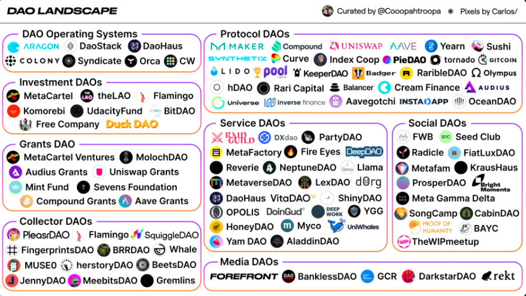

- DAOケーススタディ編
- コレクターDAO: Wahle? 
- サービスDAO: Guilds? 
- インベスターDAO: Seedclub, LAO
- ソーシャルDAO: Friends with Benefits
- 小規模目的特化型DAO: Orochi/ChillaxDAO
- 中規模ソーシャルDAO: ForeFront/FriendsWithBenefit
- 既存サービスのDAO化 Gitcoin/ENS
- 社内発DAO: Bushi-Do

### DAOの種類

DAOの歴史の章で様々な種類のDAOをみてきました。チャットチャネルとマルチシグウォレットとを持っただけのようなシンプルな携帯から何万人ものメンバーを抱え、多額の資金を持ったDAOまで様々です。

80以上のDAOに関わっているというCooper Turleyのまとめた[DAO landscape](https://coopahtroopa.mirror.xyz/_EDyn4cs9tDoOxNGZLfKL7JjLo5rGkkEfRa_a-6VEWw)という記事がカテゴリーわけされています。

- DAO オペレーティングシステム = DAOを運用するためのフレームワークツールなどを提供しているサービス群、Aragon, DAOHausなど
- 助成金DAO＝DAOの最初のユースケースとも言われ、コミュニティメンバーがお金を出し合い、援助するプロジェクト等を投票して決めます。転送可能なトークンが必ずしも必要ではなく、実際に（Molochなどの）初期のDAOは転送不可能なシェアによって投票権を実現していました。Metacartel, Uniswap Grants DAO など

- プロトコルDAO＝Defiなどのプロジェクトが創業チームに集中した決定権をコミュニティに委ねるために、「ガバナンストークン」を発行したものです。トークンを持つことでイールドファーミングやプロモーションといったことにどのようにトークンを分配するかの決定権を得ます。プロトコルDAOの重要な点として、コミュニティーの間で意思決定を行うための多くの仕組みを生み出したことでしょう。Maker, Compound, Uniswap, Yearn, Sushi, Synthetixなど

- 投資DAO＝メンバー間で資金をプールして、有望なプロジェクトに初期の段階から投資するためのDAO。助成金DAOから派生したものもありますが、（投資という性質上）法的面での制約がより多くかかってきます。Metacartel Ventures, theLAOなど

- サービスDAO = トークンを立ち上げた全てのプロジェクトは任務を遂行してくれるタレントが必要です。マーケティング、開発、財務管理といったDAOに特化したWeb3傭兵達が集まったグループのことを指します。彼らは通常プロトコルトークンで対価を受け取り、貢献したネットワーク価値のオーナーシップを得ます。
- ソーシャルDAO = ソーシャルDAOは経済的な対価よりもソーシャルキャピタルを重要視します。SNSが全ての人をメディア会社に変貌させるのに比べ、ソーシャルDAOは全てのグループチャットをでデジタルビジネスに変貌します。
- コレクターDAO = 主にNFTなどのアイテムをグループで所有することに特化したDAO
- メディアDAO = メディアのDAO化

オペレーティングシステムDAO（Aragon、DaoHaus）、助成金DAO（Metacartel）、プロトコルDAO（Yearn,Uniswap）についてはDAOの歴史の章で繰り返し取り上げました。

この章では筆者が実際に体験したDAOに関していくつか紹介していきます。

- ENS（プロトコルDAO）
- OrochiDAO（サービスDAO）
- Forefront（メディアDAO）

もちろん筆者の個人的な経験のみでDAOの全てを語り尽くすことはできません。インタビューの章では以下のプロジェクトについて述べていこうと思います。

- Defi project(プロトコルDAO)
- PleasrDAO (コレクターDAO)
- DaoHaus(DAOオペレーティングシステム)
- Friends With Benefit(ソーシャルDAO)
- Raid Gild/FireEyes DAO (サービスDAO)